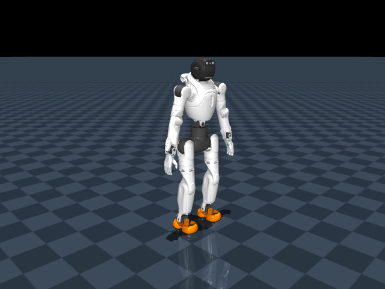

> Historical experiment record. The submitted model and current results are described in [RESULTS.md](RESULTS.md).

> Later work verified transfer to the deeper crouch and corrected contact normalization. See [the latest stage results](DEEP_CROUCH_STAGE_RESULTS.md). This page preserves the preceding experiment.

# Local crouch-to-standing result

The frozen PPO actor passes **5/5 moderate-crouch rises and 5/5 standing holds** in CPU MuJoCo. It still achieves **0/5 supine recoveries**. This is a working intermediate skill, not a completed ground-recovery assessment. The private development branch is `physics-v2`.

| Controller | Moderate crouch | Standing start | Supine start |
|---|---:|---:|---:|
| Direct demonstration clone | 0/5 | Not tested | Not tested |
| Clone with observation noise | 0/5 | Not tested | Not tested |
| Clone with off-reference demonstrations | 5/5 | 5/5 | 0/5 |
| Final PPO refinement, update 362 | **5/5** | **5/5** | **0/5** |

The final PPO crouch evaluations use fresh seeds 6001–6005; demonstration seeds are 101–116 and 121–124. These are small perturbations of one physically generated crouch, not broad robustness testing. Earlier seeds 3001–3005 informed development. Standing tests use 4001–4005 and supine tests use 1001–1005.

Each final crouch rollout starts at about 0.526 m pelvis height, below the 0.6048 m standing threshold. It reaches clean standing and holds it for 9.66 s of the full 10 s test. All five finish cleanly. The feet retain correct left/right ordering, point forward, have flat soles, and do not brace against each other. Evaluation also requires upright posture, both feet supporting, no other ground support, and low body speeds.

Joint position, velocity and commanded effort are audited at **1 kHz**; posture and contact conditions are checked at **50 Hz**. Across these five rises, maximum position overshoot is zero, peak joint speed is **0.199 times the URDF rating**, and peak commanded effort is **0.700 times the rating**. All five standing tests and all five unsuccessful supine attempts also remain within the monitored limits. Controller and contact settings remain simulation assumptions, not hardware calibration.

## Replay

From this project directory on the configured PC:

```bash
./RUN_CROUCH_DEMO.sh
```

The simulator opens for one minute with a **CROUCH ONLY** label and uses the frozen learned actor. No scripted teacher supplies actions during this replay. The initial crouch is generated by a separate physical reset procedure before the timed episode. `./RUN_DEMO.sh` remains the historical floor-recovery experiment, not this curriculum demo.

[Watch the 10-second final policy video](artifacts/experiments/crouch_ppo/video/episode.mp4).



## Method and compute

A slow, bounded scripted crouch-rise first passed 5/5 reference checks. Straight imitation then failed despite tiny held-out action error: its own actions moved it away from the demonstrated states. Adding eight off-reference rollouts produced a useful actor. Those rollouts blend the failed actor with 90% or 60% teacher commands; their labels remain time-based teacher commands and are not an optimal corrective expert. Training uses 12,000 observation/action pairs, with whole seeds reserved for supervised validation.

The successful actor initialized a separate **300.63-second PPO run**, with 256 GPU environments, 362 updates and 2,224,128 transitions. No teacher runs during PPO. The actor observation normalizer stays frozen; exact tensor comparison verifies this. The parent critic is inherited, while PPO optimizer state and counters start fresh. The final actor is selected because it passes the complete-duration CPU crouch and standing checks. The successful supervised actor and both failed clones remain available.

The logged stochastic GPU training success remains zero. A separate **deterministic GPU diagnostic passed 16/16 initial episodes** (11 unique seeds sampled from the reset pool), each reaching the training environment's two-second clean-hold termination in 2.32–2.34 s, with no invalid states, timeouts or reported limit faults. It stopped after 117 control steps, approximately 14.9 s wall time, with no training or exploration noise. This supports an exploration-sensitivity explanation for the difference, but does not prove its cause. GPU contact/bracing criteria are approximations; the CPU tests independently check actual contacts and the full 10 s duration. Disturbance and noise robustness remain unproven.

## Next transition

A bounded scripted screen found one feasible deeper reference out of eight candidates: hip −0.9, knee 1.6 and ankle −0.7 radians. It lowers the pelvis to 0.4715–0.4716 m and returns cleanly in 5/5 separate tests without clipping commands or violating monitored limits. Seven candidates with knee bend at least 1.7 radians fell during lowering. These are scripted-reference results only; the policy has not learned the deeper transition. The earlier −0.85-radian ankle command was outside the actual guarded target range and was corrected in this screen.

The next work should improve disturbance/noise robustness while extending the verified reference through deeper crouch and kneeling/sitting toward a supine start. More cloud capacity alone does not supply the missing transition.

## Reproduction and evidence

```bash
PYTHONPATH=src .venv/bin/python scripts/validate_balance.py --start crouch \
  --checkpoint artifacts/experiments/crouch_ppo/actor.pt --seed 6001 \
  --output artifacts/local_evaluation/crouch.json
./TRAIN_CROUCH.sh --output artifacts/runs/crouch_reproduction
```

The training launcher performs another bounded five-minute run; it does not overwrite the frozen actor. GPU results need not be bit-for-bit identical.

- [Frozen actor, checkpoint, configuration, progress and hashes](artifacts/experiments/crouch_ppo/manifest.json).
- [Five crouch episodes](artifacts/experiments/crouch_ppo/crouch_evaluation.json), [standing episodes](artifacts/experiments/crouch_ppo/balance_evaluation.json), [supine failures](artifacts/experiments/crouch_ppo/supine_evaluation/summary.json).
- [Actual PPO training curve](artifacts/experiments/crouch_ppo/training_curve.png), [method details](docs/CROUCH_STAGE.md), [deeper reference](artifacts/validation/crouch_stage/deeper_reference/README.md).
- [Deterministic GPU diagnostic: 16/16 initial episodes](artifacts/validation/crouch_stage/gpu_deterministic/summary.json).
- [32 passing CPU/controller/ROS tests](artifacts/validation/crouch_stage/tests.log), [visible replay log](artifacts/validation/crouch_stage/final_viewer.log), [normalizer audit](artifacts/validation/crouch_stage/normalizer_freeze.json).

The timed training and viewer processes exited normally. No cloud resources were used. The monitoring heartbeat remains paused. The historical main-branch submission ZIP has not been presented as an improved policy or submitted to the employer.
