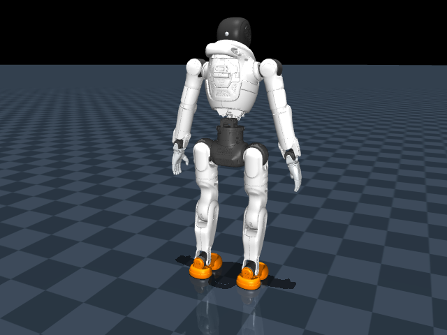

> This is the earlier physics/balance phase. See [the completed crouch-to-standing stage](CROUCH_STAGE_RESULTS.md) for the latest policy and replay.

# Physics v2: local progress

**Clean standing is now demonstrated. Full supine recovery remains unsolved.** The changes are on `physics-v2`; the earlier main branch and local-results ZIP remain a frozen historical partial result.

| Controller / policy | Perturbed standing, 10 s | Within joint limits during standing | Supine recovery, 15 s | Within joint limits during supine attempt |
|---|---:|---:|---:|---:|
| Guarded nominal pose controller (not learned) | 5/5 clean | 5/5 | Not separately assessed | Not separately assessed |
| Balance PPO, random network initialization | 5/5 clean | 5/5 | 0/5 | 5/5 |
| Balance PPO, nominal-pose initialization | 5/5 clean | 5/5 | 0/5 | 5/5 |

Standing validation uses seeds 2001–2005, outside the training reset bank (2–17). Each episode was checked for 10 seconds; both learned policies remained clean and stable at the end. These are five closely related starts, not broad robustness evidence. Supine evaluation uses the original seeds 1001–1005 and the same 15-second deadline. Both policies time out while down; complying with limits without getting up is not recovery success.

The two PPO pilots each ran for approximately three minutes: 222 updates / 1,363,968 transitions, and 212 updates / 1,302,528 transitions. They used 256 environments on the local GPU. The second starts with a zero actor mean, corresponding to the already validated nominal target, and smaller exploration. Its initial balance ability comes from that disclosed controller prior. Neither run used the old twisted-stance checkpoint.

The stochastic training success metric stayed poor even though final deterministic evaluation passed. A mid-run checkpoint at update 101 failed all five balance checks; the final checkpoint at update 222 passed all five. Evaluation of fixed saved actors takes precedence over interpreting reward or training success alone.

## What changed

- Added a separately versioned `guarded_v2` profile: earlier joint-stop engagement, smaller physics steps and effort-limited velocity control. URDF masses, inertias and published position/effort bounds are unchanged. These are simulation/controller assumptions, not calibrated hardware dynamics.
- Added an independent monitor at every physics step. Position, speed or effort violations latch for the episode. A later upright pose cannot erase them. Guarded GPU training rejects violating trajectories.
- ROS and the default evaluation now reject the old policy's violations. Historical posture-only reproduction requires `--posture-only` and still includes the independent limit report.
- Added standing-start curriculum support, deterministic balance validation and a physically generated moderate crouch start. Training reset mode and physics profile are preserved on checkpoint resume.
- Fixed passive-viewer shutdown by waiting for its owned render thread before interpreter cleanup. Two pilot viewers had crashed on shutdown; a subsequent timed visible test closed with exit code 0. Training and saved headless results were unaffected.

All **31 CPU/controller/ROS unit tests passed**. A real ROS integration test accepted a start, rejected a busy request, published actual joint telemetry and correctly ended `FAILED` for a limit violation. The headless evaluation launcher also rejects the old actor. The visible simulator was opened during both pilots; no training, viewer or ROS process is now running.

## Replay the new learned balance

From this project directory:

```bash
./RUN_BALANCE_DEMO.sh
```

The window is labelled **BALANCE ONLY** and runs for one minute. It starts upright, so this must not be presented as ground recovery. The frozen demonstration actor is `artifacts/experiments/balance_prior_v2/actor.pt`.



[Five-second learned balance video](artifacts/validation/physics_v2/learned_balance.mp4).

## Next justified experiment

A one-seed scripted test slowly lowered the robot into moderate crouches (knee bends 0.6, 1.0 and 1.4 radians) and returned to clean standing within all monitored limits. A deeper 1.7-radian crouch fell, so it is not a valid reference. The first learned balance policy also achieved 0/5 successes when started from the moderate crouch: balance learning alone does not supply the transition skill.

The next stage should teach the validated crouch-to-standing trajectory, then extend the reference through verified kneeling/sitting transitions toward supine recovery. Validate each transition for contact, posture and trajectory limits before longer PPO training. Keep final assessment starts supine. This phase used no cloud resources, and more cloud compute is not yet justified.

## Reproducible evidence

- [Controller and physics diagnosis](artifacts/validation/physics_v2/README.md).
- [First PPO balance evaluation](artifacts/experiments/balance_v2/balance_evaluation.json), [supine evaluation](artifacts/experiments/balance_v2/supine_evaluation/summary.json), [crouch transfer failure](artifacts/experiments/balance_v2/crouch_evaluation.json).
- [Nominal-prior PPO balance evaluation](artifacts/experiments/balance_prior_v2/balance_evaluation.json), [supine evaluation](artifacts/experiments/balance_prior_v2/supine_evaluation/summary.json).
- [Scripted crouch reference screen](artifacts/validation/physics_v2/crouch_screen.json), [strict ROS test](artifacts/validation/physics_v2/ros/integration.json), [unit tests](artifacts/validation/physics_v2/tests.log).
- Full checkpoints, exported actors, configurations, progress logs, initialization provenance, training curves and checksums accompany both experiments.
