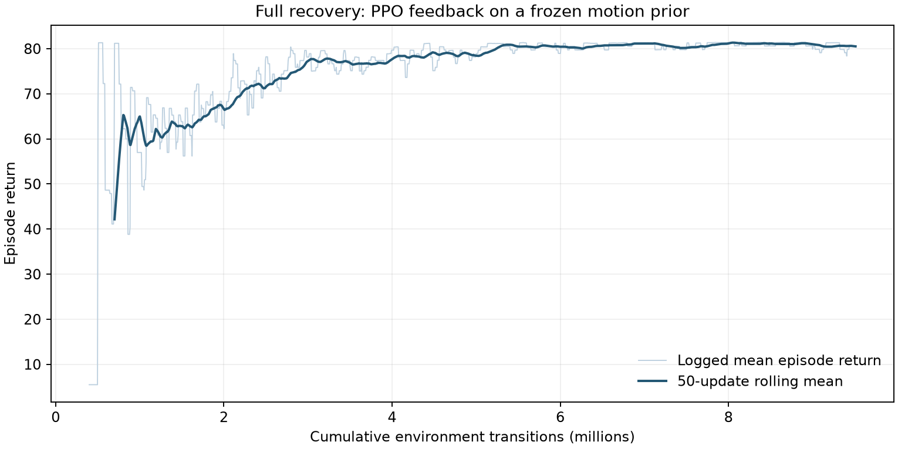

# Final recovery results

The submitted policy passed **5/5 fresh assessment episodes**, seeds 30001–30005. Each episode starts from a physically settled supine pose, runs for 15 seconds, and finishes with at least two continuous seconds of stable, uncrossed standing. No position, speed or commanded-effort limit violation occurred. The final checkpoint also passed the ten earlier evaluation seeds 27201–27210.

| Seed | Result | Simulated duration (s) | Final clean hold (s) | Maximum joint speed / rated speed |
|---|---|---:|---:|---:|
| 30001 | PASS | 15.00 | 2.14 | 0.957523 |
| 30002 | PASS | 15.00 | 2.14 | 0.960271 |
| 30003 | PASS | 15.00 | 2.14 | 0.957334 |
| 30004 | PASS | 15.00 | 2.14 | 0.957256 |
| 30005 | PASS | 15.00 | 2.14 | 0.960487 |

The five-episode maximum commanded-effort ratio is 1.0; maximum position excursion is zero. Torque reaches the configured limit, so this result should not be read as spare hardware torque capacity. Limits are checked at every 1 ms physics step; support and stance at every 20 ms control step.

[Five-episode measurements](artifacts/submission/final_recovery/evaluation_5.json) · [Earlier ten-episode measurements](artifacts/submission/final_recovery/evaluation_10.json) · [Video](artifacts/submission/final_recovery/recovery.mp4) · [Model manifest](artifacts/submission/final_recovery/manifest.json)

## What counts as a pass

At the end of the full 15-second trajectory, the following must have held together for at least two seconds: pelvis height ≥0.6048 m; torso tilt ≤15°; base linear speed <0.15 m/s and angular speed <0.3 rad/s; both feet carry >2 N floor force and other bodies together carry ≤2 N. Foot separation must be 0.16–0.36 m, heading errors ≤25°, sole tilt ≤20°, hip yaw within ±0.45 rad, and mutual foot bracing force ≤2 N. A joint-limit excursion at any point fails the attempt, even if the robot later stands.

The stance checks address the crossed-foot solution observed in early training. They are geometric and force thresholds rather than a subjective visual judgement. [Full environment and reward specification](docs/environment.md)

## What was learned

The final controller is an included frozen, supervised motion prior plus a PPO feedback network. The prior was fitted to eight successful project-generated trajectories. It already passed 10/10 validation episodes before PPO. A short 51-update starting run was followed by 1,497 updates over approximately 30 minutes on the local RTX 5060. The final checkpoint contains 1,548 cumulative updates / 9,510,912 transitions.

The PPO correction is bounded to ±0.01 in normalized action units and operates over the complete recovery episode. It is a real state-dependent policy update, but these tests do **not** demonstrate a success-rate gain over the prior or that PPO discovered the get-up sequence. The separate pre/post evaluations used different seeds. [Raw progress](artifacts/submission/final_recovery/progress.jsonl) · [Training configuration](artifacts/submission/final_recovery/training_config.json)

## Deployment checks

The submitted actor passed the fresh ROS build and launch checks: immediate acceptance, busy rejection, changing joint telemetry, successful full recovery, wall timeout and simulated-duration timeout. The ROS package has 28 passing tests; the Python simulation/policy/demo suite has 23 passing tests. The video is a new simulated run of seed 30001 using the same actor and physics profile. [ROS commands and logs](docs/ros_validation.md)

## Limitations and next experiment

All reported episodes use a narrow perturbation of one supine pose on a fixed flat floor. They do not establish reliability for side/prone falls, large joint perturbations, pushes, friction changes or real hardware. The phase prior provides most of the movement, while the small feedback bound limits how much PPO can recover from timing errors. The two-second endpoint hold remains the assessment check. The policy also held the default seed upright through 120 simulated seconds with no state-limit fault, keeping a clean uncrossed stance for the final 107.14 s of that run ([measurements](artifacts/submission/final_recovery/verification/extended_hold_120s.json), reproduce with `scripts/verify_extended_hold.py`); this single-seed check does not establish indefinite balance or disturbance robustness. Live-window restart and close were checked separately.

Early direct PPO attempts failed through motion after standing, crossed-foot bracing and state-limit violations. Their original results and checkpoints remain in Git history; [development history](docs/development.md) explains how to inspect them. The final result applies only to `artifacts/submission/final_recovery/actor.pt` under the documented `guarded_v2` contract.

The next experiment should compare the frozen prior and final PPO actor on identical disturbed starts, then increase reset diversity gradually. That would measure whether learned feedback adds useful robustness rather than relying on reward alone.
